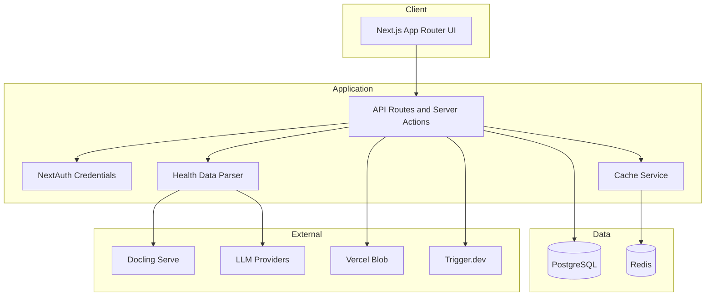
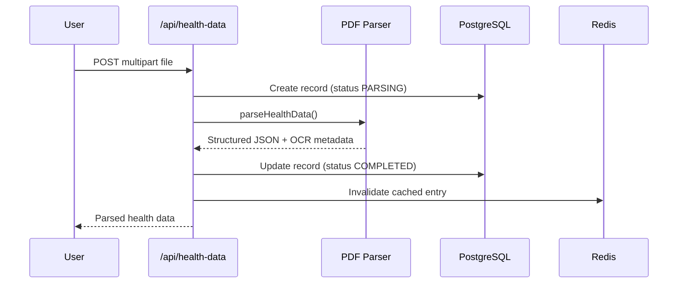
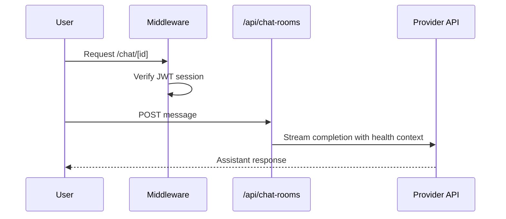

# OpenHealth

A self-hostable health data platform that combines structured medical records with AI-assisted conversations. Upload lab results, health checkups, and personal health context — then chat with LLM providers using that data as grounded context.

Built with Next.js 15, TypeScript, PostgreSQL, and an optional Redis cache layer for production deployments.

---

## Table of Contents

- [Features](#features)
- [Architecture](#architecture)
- [Workflows](#workflows)
- [Project Structure](#project-structure)
- [Requirements](#requirements)
- [Installation](#installation)
- [Configuration](#configuration)
- [Development](#development)
- [Testing](#testing)
- [Troubleshooting](#troubleshooting)
- [Contributing](#contributing)
- [FAQ](#faq)
- [License](#license)

---

## Features

| Capability | Description |
|------------|-------------|
| **Health data ingestion** | Upload PDFs and images; automatic parsing into structured JSON |
| **Multi-provider LLM support** | OpenAI, Anthropic, Google Gemini, and Ollama (local) |
| **Privacy-first deployment** | Run fully local with Docling + Ollama — no cloud required |
| **Cloud mode** | Managed blob storage and Trigger.dev background jobs |
| **Internationalization** | 10 locales via next-intl |
| **Redis cache layer** | Optional persistence for API response caching with graceful degradation |
| **Credential encryption** | AES-256-CBC for stored LLM API keys |

---

## Architecture



### Deployment modes

| Mode | Storage | Parsing | Background jobs |
|------|---------|---------|-----------------|
| `local` | Filesystem (`public/uploads`) | Docling (Docker) | In-process |
| `cloud` | Vercel Blob | Upstage / cloud APIs | Trigger.dev |

---

## Workflows

### Health data upload and parsing



### Authenticated chat session



---

## Project Structure

```
open-health/
├── docs/                  # Engineering documentation and audit notes
├── messages/              # i18n translation files (10 locales)
├── prisma/                # Database schema, seed data, migrations
├── public/                # Static assets and local upload directory
├── src/
│   ├── actions/           # Next.js server actions
│   ├── app/               # App Router pages and API routes
│   ├── components/        # React UI components (shadcn/ui)
│   ├── context/           # React context providers
│   ├── hooks/             # Custom React hooks
│   ├── lib/
│   │   ├── api/           # API helpers (auth guards)
│   │   ├── config/        # Typed environment configuration
│   │   ├── encryption/    # AES encryption for API keys
│   │   ├── errors/        # Application error types
│   │   ├── health-data/   # Parsers (PDF, vision, document)
│   │   ├── logger/        # Structured JSON logging
│   │   └── redis/         # Connection manager and cache service
│   ├── trigger/           # Trigger.dev background tasks
│   ├── auth.ts            # NextAuth configuration
│   └── instrumentation.ts # Server lifecycle hooks
├── docker-compose.yaml    # Local stack: Postgres, Redis, Docling, app
├── Containerfile          # Production container image
└── vitest.config.ts       # Unit test configuration
```

**Design decisions:**
- Infrastructure code lives under `src/lib/` with clear sub-modules
- API auth guards are centralized in `src/lib/api/`
- Redis is optional — the app degrades gracefully when `REDIS_ENABLED=false`

---

## Requirements

- Node.js 20+
- Docker or Podman (recommended for local stack)
- PostgreSQL 15+
- Redis 7+ (optional, enabled by default)

---

## Installation

### Quick start with Docker

```bash
git clone https://github.com/OpenHealthForAll/open-health.git
cd open-health

cp .env.example .env
# Edit .env — generate AUTH_SECRET and ENCRYPTION_KEY (see Configuration)

docker compose --env-file .env up --build
```

Open [http://localhost:3000](http://localhost:3000) and register an account.

### Manual setup

```bash
npm install
cp .env.example .env

# Start PostgreSQL and Redis locally, then:
npx prisma db push
npx prisma db seed

npm run dev
```

---

## Configuration

Copy `.env.example` to `.env` and configure the following:

### Required

| Variable | Description |
|----------|-------------|
| `DATABASE_URL` | PostgreSQL connection string |
| `AUTH_SECRET` | NextAuth signing secret (32+ random bytes, base64) |
| `ENCRYPTION_KEY` | AES-256 key for API key storage (32 bytes, base64) |
| `NEXT_PUBLIC_URL` | Public URL of the application |

Generate secrets:

```bash
node -e "console.log(require('crypto').randomBytes(32).toString('base64'))"
```

### Redis

| Variable | Default | Description |
|----------|---------|-------------|
| `REDIS_URL` | `redis://localhost:6379` | Redis connection URL |
| `REDIS_ENABLED` | `true` | Set to `false` to disable caching |
| `REDIS_KEY_PREFIX` | `open-health:` | Namespace prefix for cache keys |
| `REDIS_CONNECT_TIMEOUT_MS` | `10000` | Connection timeout |
| `REDIS_MAX_RETRIES` | `10` | Max retries per request |

### Deployment

| Variable | Values | Description |
|----------|--------|-------------|
| `DEPLOYMENT_ENV` | `local` or `cloud` | Controls storage and parser backends |
| `LOG_LEVEL` | `debug`, `info`, `warn`, `error` | Logging verbosity |

### Cloud-only (when `DEPLOYMENT_ENV=cloud`)

| Variable | Description |
|----------|-------------|
| `OPENAI_API_KEY` | Platform OpenAI key |
| `ANTHROPIC_API_KEY` | Platform Anthropic key |
| `GOOGLE_API_KEY` | Platform Google key |
| `BLOB_READ_WRITE_TOKEN` | Vercel Blob storage |
| `TRIGGER_PROJECT_ID` | Trigger.dev project |
| `TRIGGER_SECRET_KEY` | Trigger.dev secret |

---

## Development

```bash
npm install        # Install dependencies
npm run dev        # Start dev server (port 3000)
npm run typecheck  # TypeScript validation
npm run lint       # ESLint
npm run test       # Unit tests (Vitest)
npm run validate   # typecheck + lint + test
npm run build      # Production build
```

### Docker services

```bash
docker compose up database redis docling-serve   # Infrastructure only
docker compose up --build                         # Full stack
```

### Ollama with Docker

When running Ollama on the host machine:

- **macOS:** `http://docker.for.mac.localhost:11434`
- **Windows:** `http://host.docker.internal:11434`

---

## Testing

Tests use [Vitest](https://vitest.dev/) and cover infrastructure modules:

```bash
npm run test           # Run all tests once
npm run test:watch     # Watch mode
```

Test files are co-located with source: `src/**/*.test.ts`

Covered areas:
- Environment configuration parsing
- Redis key building and config
- Cache service serialization
- Application error types

---

## Troubleshooting

### Build fails with encryption key error

Ensure `ENCRYPTION_KEY` is set in `.env` before running `npm run dev`. Generate a valid 32-byte base64 key (see Configuration).

### Redis connection refused

1. Verify Redis is running: `docker compose ps redis`
2. Check `REDIS_URL` matches your environment
3. Disable Redis temporarily: `REDIS_ENABLED=false`

### PDF parsing fails locally

Confirm Docling is running:

```bash
docker compose logs docling-serve
```

### Database schema out of sync

```bash
npx prisma db push
npx prisma generate
```

### TypeScript errors after pulling

```bash
npm install
npx prisma generate
npm run typecheck
```

---

## Contributing

1. Fork the repository
2. Create a feature branch: `git checkout -b feat/your-feature`
3. Run validation before committing: `npm run validate`
4. Open a pull request with a clear description

See [CONTRIBUTING.md](./CONTRIBUTING.md) for detailed guidelines.

**Commit conventions:** Use imperative mood (`feat:`, `fix:`, `chore:`, `docs:`, `test:`, `refactor:`).

---

## FAQ

**Can I run this without Redis?**  
Yes. Set `REDIS_ENABLED=false`. The application skips caching and continues to work normally.

**Is my health data sent to cloud LLMs automatically?**  
Only when you configure cloud LLM providers and use cloud deployment mode. Local mode with Ollama keeps inference on your machine.

**What file formats are supported?**  
PDF, PNG, JPEG, and other image formats. PDFs are converted to images for vision-model parsing.

**How are API keys stored?**  
LLM provider API keys are encrypted at rest using AES-256-CBC with your `ENCRYPTION_KEY`.

**Does this replace medical advice?**  
No. OpenHealth is an informational tool. Always consult qualified healthcare professionals for medical decisions.

---

## License

See [LICENSE](./LICENSE).
